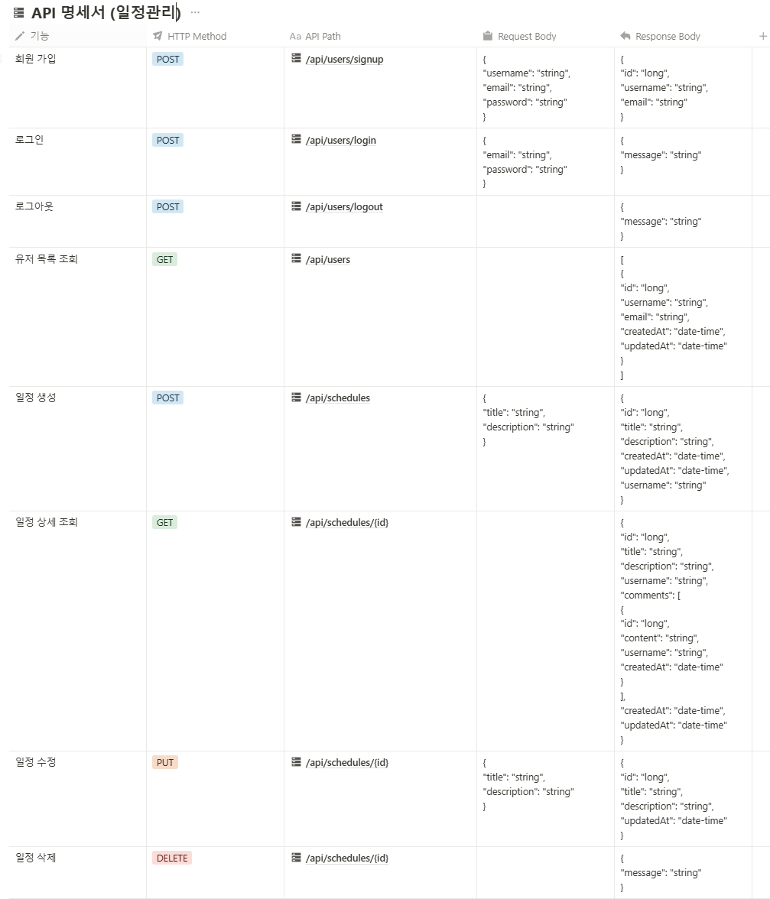
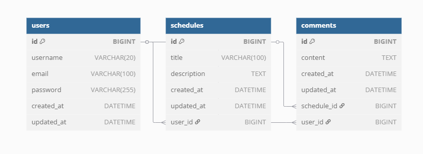

#  일정관리 서비스 (Schedule Management App)

Spring Boot 기반으로 개발된 일정 관리 웹 애플리케이션입니다.  
회원가입, 로그인(Cookie/Session 인증), 일정 및 댓글 CRUD 기능을 제공합니다.  
비밀번호는 Bcrypt 알고리즘을 사용해 암호화했습니다.

##  API 명세서

##  ERD (Entity Relationship Diagram)

